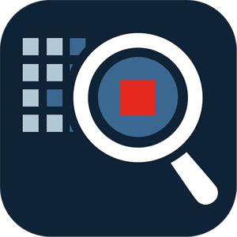
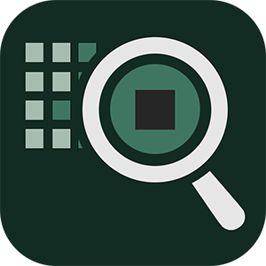

# StegoRevealer

[](https://github.com/eihnast/StegoRevealer/actions/workflows/dotnet-desktop.yml)

---

### Программа комплексного стегоаналитического детектирования "StegoRevealer"
_ПО [зарегистрировано](https://new.fips.ru/registers-doc-view/fips_servlet?DB=EVM&DocNumber=2025614424&TypeFile=html) Федеральным институтом промышленной собственности Федеральной службы по интеллектуальной собственности Министерства экономического развития Российской Федерации 21.02.2025, №2025614424._

## Описание


StegoRevealer - стегоаналитический детектор, предназначенный для обнаружения стеганографического встраивания данных в файлы изображений.

Поддерживаемые форматы анализируемых изображений:
* PNG
* BMP

StegoRevealer позволяет выполнить стегоанализ следующими методами:
* CSA (Chi-Square Attack): Метод оценки по критерию Хи-квадрат;
* RS (Regular-Singular);
* SPA (Sample Pair Analysis);
* FAN (Fast Additive Noise / HCF-COM);
* CKZhA (Consecutive Koch-Zhao Attack): Атака на последовательное встраивание по методу КохаЖао (метод Белима и Вильховского);
* ZCA (Zhilkin Compression Analysis): Метод анализа поведения при сжатии данных (метод Жилкина, Меленцовой и Рябко);
* Метод комплексного стегоанализа (бинарный классификатор, формирующий вывод на основе вычисления оценок CSA, RS, CKZhA, безэталонных статистических характеристик изображения (шум, резкость, размытость, контраст, энтропия Шеннона, энтропия Реньи) и размера изображения)

Поддерживаемые ОС:
* Windows 10 / Windows 11 (.exe)
* Ubuntu и совместимые (ELF, собран под Ubuntu 22)

По умолчанию в программе включено логирование операций. Логи и настройки хранятся во временной папке пользователя. Для Windows: ``c:\Users\user\AppData\Local\StegoRevealer``

## Графический интерфейс

StegoRevealer предоставляет графический пользовательский интерфейс для осуществления ручного стегоанализа специалистом-аналитиком.


## Сервер API (Beta)


Программа выпускается также в форме API-сервера. На данный момент он не имеет конфигурации и запускается на адресе http://localhost:5000.

Типовой запрос к запущенному серверу для осуществления стегоанализа выглядит следующим образом:
```
http://localhost:5000/api/sa/getDecision?path=IMG_PATH&verboseResult=true
```
``verboseResult`` включает вывод подробных данных о всех результатов вычислений отдельных алгоритмов в составле комплексного стегоанализа.

Ответ запроса предоставляет стегоаналитическую информацию в формате JSON. Например:
```json
{
  "isHidingDetected": true,
  "steganalysisResult": {
    "chiSquareHorizontalVolume": 0.14794921875,
    "chiSquareVerticalVolume": 0.14794921875,
    "rsVolume": 0.098581594474544,
    "kzhaHorizontalThreshold": 0,
    "kzhaHorizontalMessageBitVolume": 0,
    "kzhaVerticalThreshold": 0,
    "kzhaVerticalMessageBitVolume": 0,
    "noiseValue": 1.80602136215222,
    "sharpnessValue": 125.157900270019,
    "blurValue": 2.10231001762825,
    "contrastValue": 0.312726282286162,
    "entropyShennonValue": 6.64421417564485,
    "entropyRenyiValue": 6.5442823668356,
    "pixelsNumber": 4194304
  }
}
```
