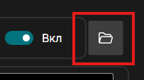
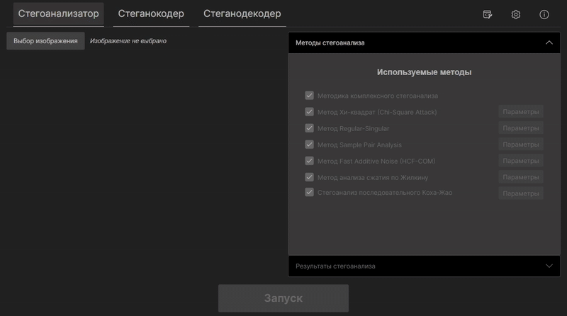
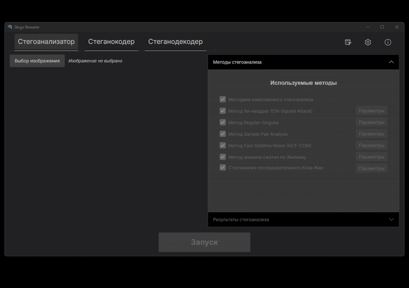
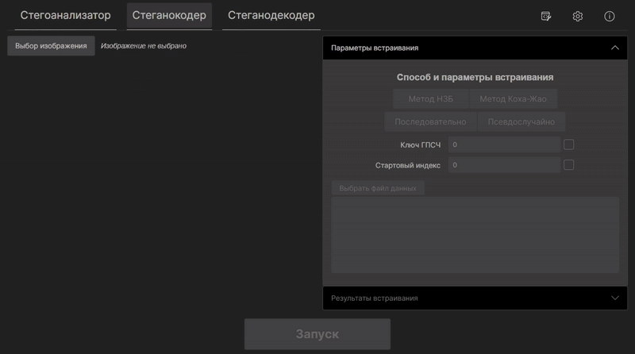
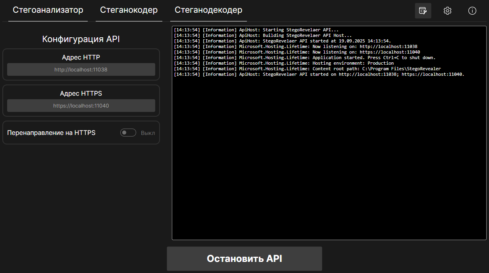

# StegoRevealer

[](https://github.com/eihnast/StegoRevealer/actions/workflows/dotnet-desktop.yml)

---

### Программа комплексного стегоаналитического детектирования "StegoRevealer"
_ПО [зарегистрировано](https://new.fips.ru/registers-doc-view/fips_servlet?DB=EVM&DocNumber=2025614424&TypeFile=html) Федеральным институтом промышленной собственности Федеральной службы по интеллектуальной собственности Министерства экономического развития Российской Федерации 21.02.2025, №2025614424._

## Описание


StegoRevealer - стегоаналитический детектор, предназначенный для обнаружения стеганографического встраивания данных в файлы изображений.

#### Поддерживаемые форматы анализируемых изображений:
* PNG
* BMP

#### StegoRevealer позволяет выполнить стегоанализ следующими методами:
* `CSA` (Chi-Square Attack): Метод оценки по критерию Хи-квадрат;
* `RS` (Regular-Singular);
* `SPA` (Sample Pair Analysis);
* `FAN` (Fast Additive Noise / HCF-COM);
* `CKZhA` (Consecutive Koch-Zhao Attack): Атака на последовательное встраивание по методу КохаЖао (метод Белима и Вильховского);
* `ZCA` (Zhilkin Compression Analysis): Метод анализа поведения при сжатии данных (метод Жилкина, Меленцовой и Рябко);
* Методика комплексного статистического стегоанализа (бинарный классификатор, формирующий вывод на основе вычисления оценок CSA, RS, CKZhA, абсолютных оценок качества изображения (шум, резкость, размытость, контраст, энтропия Шеннона, энтропия Реньи) и размера изображения)

#### Поддерживаемые ОС:
* Windows 10 / Windows 11 (.exe, протестирован в: Windows 11 24H2)
* Linux (ELF, протестирован в: Ubuntu 24.04, Kubuntu 25.04, Mint 22.1, Alt Workstation 10.04, RedOS 8)

#### Логирование и конфигурация:

* По умолчанию в программе включено логирование операций. Логи и настройки хранятся во временной папке пользователя. Для Windows: ``c:\Users\user\AppData\Local\StegoRevealer``
* Файл конфигурации создаётся при первом запуске программы автоматически.
* Настройки десктопного приложения могут быть установлены через графичесекий интерфейс программы в соответствующей вкладке.
* Переход к временной папке с логами и настройками

можно осуществить через соответствующую кнопку в меню параметров.

## Графический интерфейс

Настройки десктопной версии программы хранятся в файле ``StegoRevealerSettings.json``.

StegoRevealer предоставляет графический пользовательский интерфейс для осуществления ручного стегоанализа специалистом-аналитиком. Также через графический интерфейс может быть осуществлён запуск сервера API, позволяющего выполнять автоматизированный стегоанализ.

### Стегоанализатор

При запуске программы по умолчанию открывается окно стегоанализатора. Он предоставляет возможность выбора изображения, настройки параметров методов стегоанализа, анализа гистограммы модулей разниц значений коэффициентов матриц ДКП.



При включении и успешном завершении работы методов CSA и RS после выполнения стегоанализа становится доступна кнопка "Совместный вывод". С её помощью можно оценить результаты согласно методике совместного формирования стегоаналитического вывода (https://doi.org/10.21683/1729-2646-2021-21-3-39-46).

Пример окна совместного вывода:


После загрузки изображения возле кнопки параметров метода стегоанализа последовательного встраивания по Коха-Жао становится доступна кнопка для анализа гистограммы, на которой отображены значения модулей разниц модулей коэффициентов матриц ДКП (частотного представления изображения).

Пример окна гистограммы:



### Стеганокодер и стеганодекодер

StegoRevelaer предоставляет некоторые базовые возможности по осуществлению встраивания/извлечения данных методами НЗБ и Коха-Жао в рамках соответствующих окон.



После осуществления встраивания при помощи кнопок под изображением можно визуально оценить изменения и сравнить изображения до и после встраивания для оценки величины искажений, внесённых встраиванием.

## API


Программа выпускается также в форме сервера API. Конфигурация сервера API хранится в файле ``StegoRevealerApiSettings.json``.

По умолчанию сервер запускается на порте 11038 (HTTP) и 11040 (HTTPS).

Помимо отдельного исполняемого файла, поставляемого с релизами программы, запуск сервера API может быть осуществлён из графического интерфейса программы.



В данном окне интерфейса можно изменить настройки сервера API, выполнить его запуск/остановку, а также отслеживать логи, которые пишет процесс сервера.

### Методы API

| Метод         | Тип  | Путь                  | Тело запроса / параметры           | Назначение анализа                     |
| ------------- | ---- | --------------------- | ---------------------------------- | -------------------------------------- |
| `GetDecision` | GET  | `/api/sa/getDecision` | `path`, `verboseResult` (optional) | Упрощённый вызов `ComplexSsaAsync`     |
| `GetDecision` | POST | `/api/sa/getDecision` | JSON: `ComplexSsaRequest`          | Упрощённый вызов `ComplexSsaAsync`     |
| `ComplexSsa`  | GET  | `/api/sa/complexSsa`  | `path`, `verboseResult` (optional) | Комплексный анализ (SSA)               |
| `ComplexSsa`  | POST | `/api/sa/complexSsa`  | JSON: `ComplexSsaRequest`          | Комплексный анализ (SSA)               |
| `Full`        | GET  | `/api/sa/full`        | `path`                             | Упрощённый вызов `FullAnalysis`        |
| `Full`        | POST | `/api/sa/full`        | JSON: `FullAnalysisRequest`        | Упрощённый вызов `FullAnalysis`        |
| `FullAnalysis`| GET  | `/api/sa/fullAnalysis`| `path`                             | Объединённый анализ (все методы)       |
| `FullAnalysis`| POST | `/api/sa/fullAnalysis`| JSON: `FullAnalysisRequest`        | Объединённый анализ (все методы)       |
| `Csa`         | GET  | `/api/sa/csa`         | `path`                             | Chi-Square Attack (CSA)                |
| `Csa`         | POST | `/api/sa/csa`         | JSON: `CsaRequest`                 | Chi-Square Attack (CSA)                |
| `Rs`          | GET  | `/api/sa/rs`          | `path`                             | Regular-Singular (RS)                  |
| `Rs`          | POST | `/api/sa/rs`          | JSON: `RsRequest`                  | Regular-Singular (RS)                  |
| `Spa`         | GET  | `/api/sa/spa`         | `path`                             | Sample Pair Analysis (SPA)             |
| `Spa`         | POST | `/api/sa/spa`         | JSON: `SpaRequest`                 | Sample Pair Analysis (SPA)             |
| `Fan`         | GET  | `/api/sa/fan`         | `path`                             | Fast Additive Noise (FAN) / HCF-COM    |
| `Fan`         | POST | `/api/sa/fan`         | JSON: `FanRequest`                 | Fast Additive Noise (FAN) / HCF-COM    |
| `Ckzha`       | GET  | `/api/sa/ckzha`       | `path`                             | Стегоанализ скрытия по Коха-Жао (CKZhA)|
| `Ckzha`       | POST | `/api/sa/ckzha`       | JSON: `CkzhaRequest`               | Стегоанализ скрытия по Коха-Жао (CKZhA)|
| `Zca`         | GET  | `/api/sa/zca`         | `path`                             | Анализ поведения при сжатии (ZCA)      |
| `Zca`         | POST | `/api/sa/zca`         | JSON: `ZcaRequest`                 | Анализ поведения при сжатии (ZCA)      |
| `Statm`       | GET  | `/api/sa/statm`       | `path`                             | Расчёт оценок качества изображения     |
| `Statm`       | POST | `/api/sa/statm`       | JSON: `StatmRequest`               | Расчёт оценок качества изображения     |

Во всех случаях:
* `path` - это путь к файлу изображения, который необходимо проанализировать.
* `verboseResult` - возвращает все результаты работы задействованных методов стегоанализа, а не только вывод методики комплексного статистического стегоанализа.
* POST-методы принимают JSON-запросы, которые должны включать указание:
  * либо `ImageUrl` - пути к файлу изображения;
  * либо `ImageData` - изображение, закодированное в Base64 (без префиксов с указанием типа).

## Параметры методов стегоанализа

Все указанные параметры могут быть переданы в теле соответствующих POST-запросов в формате JSON.

Также данные параметры настраиваются в графическом интерфейсе десктопного приложения.

Общие типы:
* `TraverseType`: `Horizontal` / `Vertical` - тип обхода матрицы пикселей;
* `Channels`: `Red`, `Green`, `Blue` - цветовые каналы.

### CSA

| Имя параметра                  | Тип              | Описание                                                          | Значение по умолчанию  |
| ------------------------------ | ---------------- | ----------------------------------------------------------------- | ---------------------  |
| `Visualize`                    | `bool`           | Визуализировать подозрительную область                            | `false`                |
| `TraverseType`                 | Тип обхода       | Тип обхода матрицы пикселей                                       | `Horizontal`           |
| `UseSeparateChannelsCalc`      | `bool`           | Применять ли алгоритм по отдельности для каждого канала           | `true`                 |
| `UseUnitedCnum`                | `bool`           | Считать ли общее количество интенсивности цветов без учёта канала | `true`                 |
| `UsePreviousCnums`             | `bool`           | Использовать ли режим подсчёта с накоплением                      | `true`                 |
| `ExcludeZeroPairs`             | `bool`           | Исключать ли из анализа пары, где ожидаемая частота цвета = 0     | `true`                 |
| `UseUnifiedCategories`        | `bool`           | Объединять ли низкочастотные категории                            | `true`                 |
| `UnifyingCategoriesThreshold` | `int`            | Верхний порог частот для объединения                              | 4                      |
| `Threshold`                    | `double`         | Порог значения p-value                                            | 0.95                   |
| `Channels`                     | Массив каналов   | Анализируемые каналы                                              | `Red`, `Green`, `Blue` |
| `BlockWidth`                   | `int`            | Ширина анализируемого блока                                       | Ширина изображения     |
| `BlockHeight`                  | `int`            | Высота анализируемого блока                                       | 1                      |

### RS

| Имя параметра                  | Тип              | Описание                    | Значение по умолчанию  |
| ------------------------------ | ---------------- | --------------------------- | ---------------------- |
| `TraverseType`                 | Тип обхода       | Тип обхода матрицы пикселей | `Horizontal`           |
| `Channels`                     | Массив каналов   | Анализируемые каналы        | `Red`, `Green`, `Blue` |
| `BlockWidth`                   | `int`            | Ширина анализируемого блока | 4                      |
| `BlockHeight`                  | `int`            | Высота анализируемого блока | 1                      |

### SPA

| Имя параметра                  | Тип              | Описание                                                                                | Значение по умолчанию  |
| ------------------------------ | ---------------- | --------------------------------------------------------------------------------------- | ---------------------- |
| `MethodVersion`                | Версия метода    | Версия метода                                                                           | `Original`             |
| `Direction`                    | Направление      | Направление анализа пар пикселей (если не включён UseDoubleDirection)                   | `Horizontal`           |
| `Channels`                     | Массив каналов   | Анализируемые каналы                                                                    | `Red`, `Green`, `Blue` |
| `UseDoubleDirection`           | `bool`           | Выполнять двухпроходный алгоритм (с горизонтальным и вертикальным направлением анализа) | `true`                 |

* `MethodVersion`: `Original` / `StegExpose` - версия метода SPA (из оригинальной статьи или из реализации в StegExpose);
* `Direction`: `Horizontal` / `Vertical` / `Diagonal` - направление выбора пар пикселей.

### FAN

| Имя параметра                  | Тип              | Описание                  | Значение по умолчанию  |
| ------------------------------ | ---------------- | ------------------------- | ---------------------- |
| `Threshold`                    | `double`         | Пороговое значение        | 3.401714170610843      |

### CKZhA

| Имя параметра                  | Тип                       | Описание                                                                                  | Значение по умолчанию        |
| ------------------------------ | ------------------------- | ----------------------------------------------------------------------------------------- | ---------------------------- |
| `Threshold`                    | `double`                  | Минимальный порог разницы коэффициентов, превышение служит сигналом о наличии встраивания | 20                           |
| `CutCoefficient`               | `double`                  | Порог отсечки для массива значений разности между dct-коэффициентами                      | 0.35                         |
| `TraverseType`                 | Тип обхода                | Тип обхода матрицы пикселей                                                               | `Horizontal`                 |
| `Channels`                     | Массив каналов            | Анализируемые каналы                                                                      | `Blue`                       |
| `AnalysisCoeffs`               | Массив пар коэффициентов  | Анализируемые пары коэффициентов матриц ДКП                                               | `(2, 3)`, `(2, 4)`, `(3, 4)` |
| `TryToExtract`                 | `bool`                    | Пробовать извлечь информацию автоматически                                                | `true`                       |
| `LoggingCSequences`            | `bool`                    | Включить логирование полных последовательностей cSequence                                 | `false`                      |

* `AnalysisCoeffs`: массив кортежей типа `(int, int)`, указывающих на индексы коэффициентов матриц ДКП (левый верхний коэффициент имеет индексы `(0, 0)`).

### ZCA

| Имя параметра                  | Тип              | Описание                                                          | Значение по умолчанию        |
| ------------------------------ | ---------------- | ----------------------------------------------------------------- | ---------------------------- |
| `TraverseType`                 | Тип обхода       | Тип обхода матрицы пикселей                                       | `Horizontal`                 |
| `Channels`                     | Массив каналов   | Анализируемые каналы                                              | `Red`, `Green`, `Blue`       |
| `CompressingAlgorithm`         | Метод сжатия     | Используемый метод сжатия                                         | `ZIP`                        |
| `RatioThreshold`               | `double`         | Порог средней разности степени сжатия для определения встраивания | 0.008                        |
| `UseOverallCompression`        | `bool`           | Использовать ли сжатие всего изображения (а не поканально)        | `true`                       |
| `BlockWidth`                   | `int`            | Ширина анализируемого блока                                       | 16                           |
| `BlockHeight`                  | `int`            | Высота анализируемого блока                                       | 16                           |

* `CompressingAlgorithm`: `ZIP` / `BZIP2` / `GZIP` - используемый метод сжатия.

### Методика комплексного статистического стегоанализа

Специфические параметры методы отсутствуют

### Примеры запросов и ответов API

GET-запрос метода комплексного статистического стегоанализа с подробным ответом
```
GET http://localhost:11038/api/sa/getDecision?path=e:\img1.png&verboseResult=true
```
Ответ:
```json
{
    "isHidingDetected": false,
    "steganalysisResult": {
        "chiSquareHorizontalResult": {
            "messageRelativeVolume": 0.03756906077348066,
            "messageRelativeVolumesByChannels": {
                "Red": 0.03756906077348066,
                "Green": 0.03756906077348066,
                "Blue": 0.03756906077348066
            },
            "elapsedTime": 1171,
            "hasErrors": false,
            "methodSuccessful": true
        },
        "chiSquareVerticalResult": {
            "messageRelativeVolume": 0.03756906077348066,
            "messageRelativeVolumesByChannels": {
                "Red": 0.03756906077348066,
                "Green": 0.03756906077348066,
                "Blue": 0.03756906077348066
            },
            "elapsedTime": 1207,
            "hasErrors": false,
            "methodSuccessful": true
        },
        "rsResult": {
            "messageRelativeVolume": 0.04891949547753832,
            "messageRelativeVolumesByChannels": {
                "Red": 0.04931201359356092,
                "Green": 0.0629869137533115,
                "Blue": 0.03445955908574254
            },
            "elapsedTime": 1174,
            "hasErrors": false,
            "methodSuccessful": true
        },
        "kzhaHorizontalResult": {
            "suspiciousIntervalIsFound": false,
            "threshold": 0,
            "coefficients": {
                "firstIndex": 2,
                "secondIndex": 3,
                "firstValue": 2,
                "secondValue": 3
            },
            "messageBitsVolume": 0,
            "extractedData": null,
            "suspiciousInterval": null,
            "elapsedTime": 986,
            "hasErrors": false,
            "methodSuccessful": true
        },
        "kzhaVerticalResult": {
            "suspiciousIntervalIsFound": false,
            "threshold": 0,
            "coefficients": {
                "firstIndex": 2,
                "secondIndex": 3,
                "firstValue": 2,
                "secondValue": 3
            },
            "messageBitsVolume": 0,
            "extractedData": null,
            "suspiciousInterval": null,
            "elapsedTime": 986,
            "hasErrors": false,
            "methodSuccessful": true
        },
        "statmResult": {
            "noiseValue": 24.422111332221387,
            "sharpnessValue": 82.5,
            "blurValue": 0.43435297405369355,
            "contrastValue": 0.7423836637778976,
            "entropyValues": {
                "shennon": 7.58329440639484,
                "vaida": 0,
                "tsallis": 0,
                "renyi": 7.553087210270699,
                "havard": 0
            },
            "elapsedTime": 1350,
            "hasErrors": false,
            "methodSuccessful": true
        },
        "pixelsNum": 814500,
        "isHidingDetected": false,
        "decisionProbability": 0.3095238208770752,
        "elapsedTime": 1379,
        "hasErrors": false,
        "methodSuccessful": true
    }
}
```

Пример POST-запроса `getDecision` с указанием пути файла:
```
POST http://localhost:11038/api/sa/getDecision
```
```json
{
    "ImageUrl": "https://some-domain.com/img1.png"
}
```
Пример POST-запроса `getDecision` с указанием данных изображения:
```
POST http://localhost:11038/api/sa/getDecision
```


```json
{
    "ImageData": "iVBORw0KGgoAAAANSUhEUgAAADAAAAAwCAIAAADYYG7QAAAACXBIWXMAAAsTAAALEwEAmpwYAAARaElEQVRYhVWZeYxd93XfP+f8fnd5y2wcDoekJFIbKYlSRMmSYluOHEuWF9V27FpG28Rp3QQ2giBG0bQIihbtP4nr1kgRJEEdWHFSGIkBL3IWN0YMp1URS5ZJVZZkWZIliqJIiYvIITnDmTdv3rvL75z+8R6l9AIPePct93fu2X7f87myeOD6tc1NUwmOJldLSWRZ2KbptnnNgry41tx7RfHRa7KXTl4a1enopj6+psOW1tlyGZqaYgnDPARPYG4u4GbJXUQEABMT3NxdHMMVccHdARA3wOfm54TtfWLAHXcao0ngALXff0V473J4aqU5M3ZP9s/3pOsKP7XFIxfkh+dRpIaByJZIi+DQugeRBOaOTK8JCKiSbHoKuDMx1B2ZLjg5AjuXcMOZ/joIDo5EWalludSlDheSLJTc0PNx7T9Z5UJFZaoBCm2jDnuFz3bp5syWlJEygEtyRAjggigquIMw8ZdMXn75ZPIpedGNUjde1yAkR0CcTCA40mRybOSdLGpM1+dt6XZiyOu1rNRoIAim4JKbj3GCkGc0AqDqWpEcc6KA0BqqmOGCOH7Zmqmf3rIvqlka1WQRERxCQCEEglQqxx0f+w71n9ktt3c5NyQqvZy2pjUvW3N1Sdar6oSM0CooURElV/KcGKmNqmarJgkI4tO1Xd4yCH8zmhFVRC5/AUHJIzGQCyGcUhS/ocy29d2kvXPRh42v1ITCjw3lorNNvIILSZK4ugWjriyBC6jRC3QyNowgrFdTC/xylPzNZHorj4IvzjEaI4IKAv2S2Q69DA3MFCyUfuXiZ25dvHZr/fCZ8bxyaYuFwD0LZM4rA8rItYUXyshVIBdPTiuKCG1i1FAngLkOZcZWc9kamVr2/x8hZhEcnRguZEInIwozXaKzZ4F9u2jSoWZ489Zod+aLPe4rCTnXCHtzBsn//jwpY29kA4DGfNY4j6+jkjw1yVJCFYc8Y75kUNHYtLgmqe3AtNbcCSzO4S39AhQzykgy+gUfv5tfupfVDR59vvPsq9dsDu5a8K2KHcqBg5TvunGxaO4rqk4iNswFXt6wvJBWZTmjCHKmkZmAiDi4Cm3LVk2REQMpveUb4a13IjHmgdkZcghK3RKVLIBzyx7uu52XTvOt7/fPXly8sPHGkLt32foGxy8wm5jbEWRpQa8IB6+P++rqgf3cPcv8RbexldH2RsuK8KrF2QBOcvE3Y5QHENqJS5zLNTZ5H/Jc4q7lVsa4UNfMdSkimXLPAW7bw98ciq9fvEp9eWvYbow/udseuJLRGrMb7NpP564Flq7g5z7G6ph6FRInB16PV185tvL9I0c3+eogfntQNOZd91HCHFAQojJOjBvcMZ+GzxwndrqS7Vxu6iHdDDMyZfsMO+dwR51RtXxubSdpPo17W9XBjn/+5+HO2+i21C33fMaX90l/AYeTR5DITJcysnqG86d57O/TY4f+y0/582Hv1SRU1rY+abmEAEJlpETrmE07M+SdflRLVC1FoFfSiSzPMq7ZrKjq7ePxvFWFNf3oc+pzLWzCu36Gmz5F5RRXycZxHnm4euLpzSTrTf3Iq+fPz+w8eMett95xYPl9v5i//wP/8Xv/c/GPnv7sehnLIquaxiE5KREy+pEhpBYVkoKBuxJCv5vqijyyvc9ch82K06vdpumpLYyqGbHFzLdLu+hcu8Xtn7ieD/8hcgsc4389xDcfOnX4mfld23q7F3744xOPnRisrK9fWD39/Z8cefLc4JvVzOjmt33qrt3lE09/b7X1bqdwTxLAadPl+ldkkkMKaFFENJDHacvaqlkbBLfgXsasW+ostj3zHeY7Evfthwc+iVzLi787+OP//Nwx2ZTi+Fr9a/f0zr36+jeeOH0u9Jnx8ZALUX7w3NHRM0e/NDf3z375F772+0s7/tPv/cbxYdPta+vmRjKSoxAMD0hCDBEJQfLlpboegdONzJQ0bRSbVVvMwjavl7zeQX2V8Mll9v3bT3DvR3n2e6988Wt//kgabc+ObxiN3XlFfO5S+NEq67WH7Z2iKHfsnT1cBOYW2D3HRr3/Ux870r3wJ7/x2585XhadstlsrWlpHA0IJGiMNoHEmRnV1hjXUx/WDW2rSl/oNlW3rfueOnBTxb4HD/ChX+Psoc2HvvqjV9J7PrBclZ1eN37ijt7Dx/zbJ5pxkyxZ3cRzm82PL67jTqbMzbM09/Kf/sVnuvs//V9/65cXR5WrRJ1uDKrMlJSX4yMYHuJsr21qRCgCisCcpDlJPUtz3s5iVzV88u2Uv/XvWHmRh7/+ncODw+vh7Lh59NXqxl3dTdO/Olr1CjVnqyWbL++6e8fgbLX55AWqmjfWcGXf7qdfOPaeD9776+3KH//g5c1OHwMHc7IIwrjGBUSLIuT9TlNVZEIWUKEIfbzfpq6nvlvf/d0dDv6r9zI3e/Lff+GPHh68RPbMJR55ubn/uuLMIH3p6a3ZKOJsuTQx+JhsQfs7Zx/8pXuWFueOfusZTg1Y6HHb3kPL1/7mgX2d//t3390IqJIcg9bQSek5oN1OpIUWCkgJMfplMA2t4y7iO40P3wsf+Cjf+e6PX+DlKCur7bjSmTIcWU2nN1InikStE6bSFDO1ZD9R7v/wwd03XH1NzfLVi17EbmfHwbsOfmlt6++uu+az/+LB//65h4/oLNFoDLNpq2wTSUhJVSCAQzIC5KoAHpJ54/vnCLddS/kv2f2O/Uvs7vmFEcOW2uzJM+3pLTqZtIkEjUTTsOPndu1599tOhp1fef781188sr4vq/cXN7zvplMbw2u31g93l7nptg8tCVGIioBebtYGwUU0uoKCCkAnR0THTabkkBkzGVxzO8ywZ8cNV3Jjy9+eD6tDFyMGkntqPIm4BHMhpnEvP3e6ZvMNOi2xekqq5SweSa89tbHJZn3zXfeyZ/9Hbt77e4+dJw9kgQYMFPJASkGJLkIQBKIC5VYTkgcxhTKjn4ELpz/P41//wSW+/rLMZ7KuPhJxh4SJtEFbxIKy1ay/cpGZEdVxOsq2Hts5d2V+7swLrG/Qym8vfvtX33vwxltuLB8/Nw4Rncp6YkSMWjxIVFwwd1AF7zYpxzy5grf0F0FqDn3jpf/x3BNr4Y6rw607sucutF95plltRYOYYMk9JS8zBM4MWGwYDEE4c4n6JEuzbO9RlGwrWTt3clzdii5FTqaJ6jA0EoQGBFNRC6CIudQpr9vcPZqpOeYKbQvL15Bv/9ElLo78P9w3W3aa8yFcfV3RXcrNfKtq2yZZWVKWIHJunUHDzmWSstEy2yUImw0SGSXqFMwvbqVTadp4AFRwJQoBjBgMEI8aAt1xG8VEPVMyJSQ8wOI+Dj+9soFl9uOzl751xH54PqVOJtsL3dbd5mG8MtrccpJpVeGNnF4zF2qn6NDrYA2DmjCmn7OytrYxiI17Y3ialDqiBKUCF1QUcwwyyUU0JTeT5OaYEBNzc7Bz/6XT6eXXaQhHVywGrpyR3Gy9bjd2dTd/drfMd2Q0jIN1aSvALfH6ClXL4hx0eO0SWw3rI9qaoReF3LFNl1WYqJHktDYVIeIWUECSh+SiECVEdadNVre0kNfAxvxN12+PPHc6PXqMq2bCVTOhKLU3W3bM7ciF6sTFIijgIuDiJiqMx5w4zdqQHduoGqIALG17e6i3Vt4YFiUhEIUsTgs8UwQXUczFMaOOAQ3qSKGi0u2IlRw7Cq8+z/vuv/cGUsNjJ/zIGWmrlCz13ctL4+7ra2IW8IlYF3fxJG60icGQU2fZGJNlzHZQ5cDV/XNn/uTRlzZroW1pnaAUSiYgqHpQdZ9erE0+UrXJyItkZaSjh87AN/+Mebv1YNjpdAPHL6XVLWsGaVuw8uxwfHYUgoAHPGCTu7SYURZkEVVSQ1A2xkjxr69d5MSxb56p2aqoWpoWd1BapzVUUELeLZq2mYyLuVK0Jo2JU49SMB8penTtpvuv7l2x/6W/fPZMZKEvWSkhl1Bx8lRNmN5DQhzxyY2KomE6by/2ySODip+/4zsHe4e+/K3PvziSSfaIUsTpvgZEJSt00guksdgkbdqmsVHt44atRga1jAN/cYqV//aHvGv/P/nHi0sDUuO5kifOnqhwz90zcxUCohBwTW1oKhmPcMdh2DBsyPN/+qFbF5976jf/9jiauYHbNHvKjF5OkZEFgoSi022qCiFMCIM7NpFviBOUlHP6OX/PtaPFBx/gfz9x+DTdrg5bX9n0Qpn0+fgPtp+3GowZGqkTgy0+/eHn3zHznS985fePeyyCpYQ7RUa3pFvQJqqECnkeirJTN7UoqiJKcI8GuDhRCCq58kbD/LOn9n384M3vf/v8408+84YPlSzQtMQgOtklhSgSFFVxVTSQZd4vGFV88J2r/+bu5ot/+q6/Ol3PdM0SyQiR2S475gnKYIwZBp1uKLqduq5VCSIoiqkjE72rKCjSLfnpG1x59Kkrf/3jN37wtgNHDv3oJ2wk+j2JIiEgQqbkSqmEoBpFs4wiT6OKB9754uceuOqvv3HnQ8+c6s5muDWGCr0uvZLrdiLO6xfJI0Hp90LR6dR1o4YKEsFQn1IrcVFH3QWakhdfY/ujj+x57zuXf/VTH1k4tas6G8dYAKSIFFHKIGWQLEhA2qbdzIt3fPofvfTZO3Y/+tcf+oPDj8vcTPBRC0Hp5vQ6zPXYNc9rF7mwQRaIgX4v5GUn1fV0sFUEmXgIMBCkNZIRAm3Ooz/liv9z6Or3784e/OJND77n3u755cGr+dD70YtAR7wTiMlmtvUP3HvHFz573+/elb/25a9+7MtHnu0uZJaGLZ4F5rqo0sl5980Mx7xwiii0ibKg25fuwsJoc0NREdNMKDRrPbYWsUwlVzK8hK5SqOcZV7b8zu3s+ZX7+MXfQXZw/rs8/+LGsZVnj507Z/m2pfnl5d4N1++IssmTz37uocN/cEar+ZnCWUVMhJAx20GEX3k/izN87Qe8coY8ULU0xrYF6c4vjAYbolMmQzeoktUWk+VKVDKhgOieC52MPOPK1m9J7D3Anfe9bc/e3cWubcz3yGFtwMlzzfrg1Mrqo4df/vKzPJN3upma+YaHtozkGVmk0+Fn9/GOAzz2U547wXBMMtrE2haLC9KZnR8PBxPSJ0FiEMk0YMEIeA5RPAuoEd3LQKa0jiXiyHfBQsZMTlZyyx7qES+c5tWK4xVrRfBODFGGRmWYi2VKkRFzFuf4yB0cOcNTx5nvsb7FuXVmCnbMs2XSn5kbDgciIjgqIq6ZhkzVPEB0z/AoiKPi0YnCRIXn0YOKwLByd29qkpD1QxIRY+QyhgZq0UbERVwFDZQF22ZYXuD8BmfXMDBnXBOUxVliId2ZmdFwOCElE5CrIl5IUBERdSuwaFO2FPAAUSWYT9CoO25IoHVxJIknaF0rkVakcVqRlOkUVxc5MSNGVjdxIyiNkRx3qpYmhaX5KDKlWSZTKmw4FW0hGjAR0CYQ3QVaIToJRAWYrINCEpQWDGkhiVSq7iShnTDNEIlKa9QVVNQN5hPAAEbrE3UWa4tub1E13oJaTrKkwVVbQfDgqCNCxKK74mF6sYljSUJCTKRRaUGc9CZZJZBnAHVLEFqnMQBrp9zDwWwqsJMoPqW1PoXGgkADZgSxMhBDahIqAgGJyRUPMnUNiAVMcCNBCsEF7M151MFpbEqeNysan252E7Zvk3ERBBOPl5Xem7h/wmzAXRpn0uZjJDiCI61bMhdUdQI0EZEUAhPIMqEIIQA0CXFqo21IRlDGDZWBTyacqbn+JmaUiXwJb6FQncD2fxhEIwhlnBL4iRK1y09FJn+ZDL+9SBAGNeboxD6ncep2wg8RaHzqDH/TjsvLXX4SIkt79q5fWlNwVVQRLIgEFXd3nzyZIAYJeMIFj8GDZ3Y5PZRWQptPczav2gTihNakSZKmwXBzcXATh5QMxNxRwCb1gZjZ/Pz8/wNyAzN5QXX40AAAAABJRU5ErkJggg=="
}
```